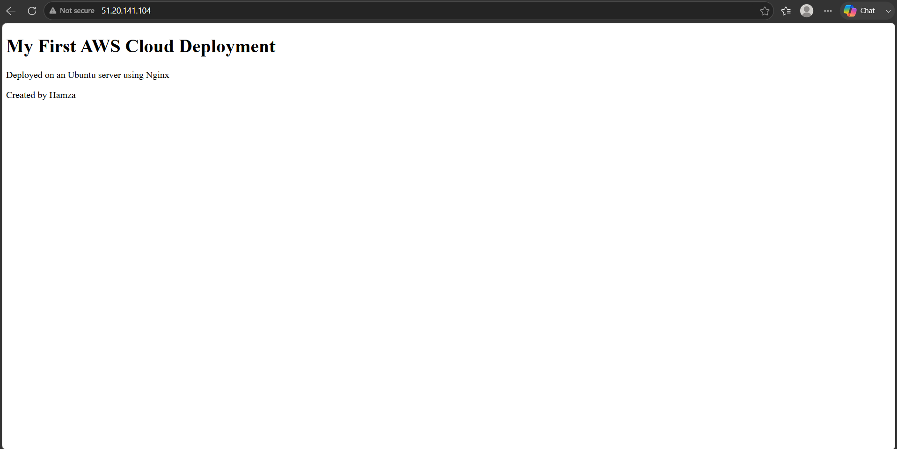

# AWS Cloud Networking Project (EC2 + VPC + Nginx)

## 🚀 Project Overview
This project demonstrates how to deploy a Linux server on AWS, configure a custom Virtual Private Cloud (VPC), and host a static website using Nginx. It evolves from a basic EC2 deployment into a real cloud networking architecture.

## 🛠️ Technologies Used
- AWS EC2
- AWS VPC
- Ubuntu Linux
- Nginx
- SSH
- HTML

## 🌐 VPC Network Configuration
-VPC CIDR: 10.0.0.0/16
-Public Subnet: 10.0.1.0/24
-Private Subnet: 10.0.2.0/24 (created for architecture design)
-Internet Gateway attached to VPC
-Route Table configured: 0.0.0.0/0 → Internet Gateway
-EC2 instance deployed inside public subnet

## 📌 Steps Performed

EC2 Deployment

1. Created an EC2 instance on AWS
2. Configured security groups (SSH & HTTP)
3. Connected to the server using SSH
4. Installed Nginx web server
5. Deployed a custom HTML website
6. Made the website publicly accessible via EC2 public IP

VPC Setup

8. Created a custom VPC (10.0.0.0/16)
9. Created public and private subnets
10. Attached an Internet Gateway to the VPC
11. Configured route tables for internet access
12. Launched EC2 instance inside the VPC public subnet

## 🌐 Result
A fully working cloud-hosted website accessible over the internet.

## 📚 What I Learned
- Basics of cloud computing (AWS EC2)
- Linux server management
- SSH remote access
- Web server configuration (Nginx)
- Networking concepts (ports, public IPs)
- Cloud networking fundamentals (VPC, subnets, routing)
-Public vs private subnet design
-Internet Gateway and traffic flow

## 📸 Project Screenshot

## 🧱 Architecture Diagram

Phase 1: Basic Deployment

User → EC2 → Nginx → Website

Phase 2: Cloud Networking (Current)

User → Internet Gateway → VPC → Subnet → EC2 → Nginx → Website

## 🔥 Status
Completed ✔️
